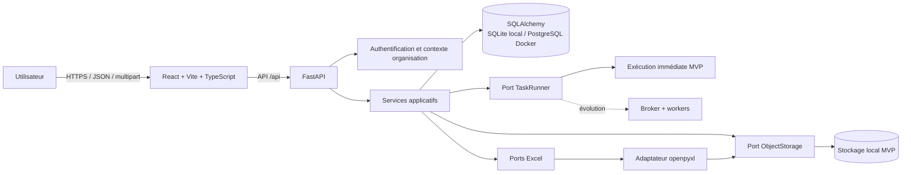
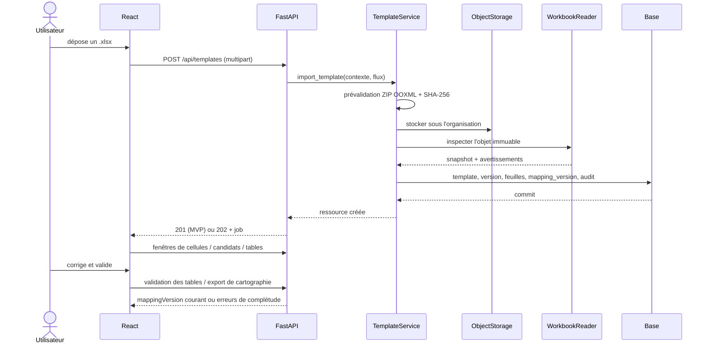
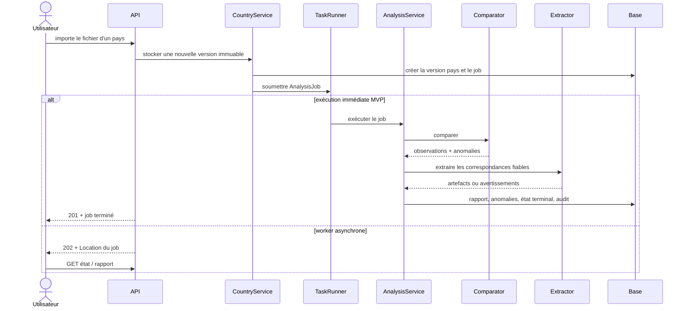
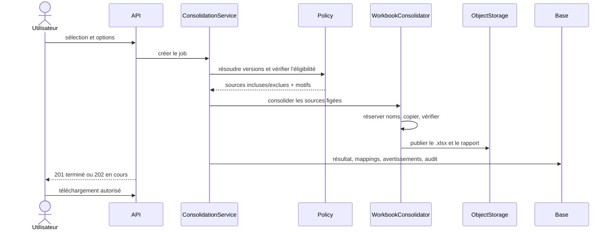

# Architecture de la plateforme POPS

## 1. Objectifs et principes

La plateforme transforme des classeurs Excel semi-structurés en objets contrôlables, traçables et consolidables sans modifier les fichiers sources. L’architecture privilégie les propriétés suivantes :

1. **reproductibilité** : chaque résultat référence un binaire et un numéro de cartographie ; la conservation immuable de chaque cartographie reste une exigence de production non entièrement couverte par le MVP ;
2. **explicabilité** : toute détection ou correspondance expose son score et ses raisons ;
3. **prudence** : l’ambiguïté bloque l’extraction et demande une validation humaine ;
4. **immuabilité** : fichiers importés, cartographies publiées, rapports et décisions historiques ne sont pas réécrits ;
5. **isolation** : chaque accès est borné à l’organisation authentifiée ;
6. **réversibilité technique** : `openpyxl`, le stockage local et l’exécuteur immédiat sont derrière des ports remplaçables ;
7. **compatibilité d’exploitation** : SQLite simplifie le poste local, PostgreSQL est la cible Docker et production.

Le MVP est un monorepo TypeScript/Python. Il reste un monolithe modulaire : un déploiement simple, mais des limites de domaine explicites permettant d’extraire un worker ou un service Excel plus tard.

## 2. Vue d’ensemble



La base conserve les métadonnées et les états ; les binaires et artefacts volumineux restent dans le stockage d’objets. Aucun fichier n’est adressé directement par un chemin venant du client.

## 3. Arborescence cible du monorepo

```text
POPS/
├── frontend/
│   ├── src/
│   │   ├── app/                    # router, providers, configuration
│   │   ├── api/                    # client HTTP typé et DTO
│   │   ├── components/             # composants accessibles réutilisables
│   │   ├── features/
│   │   │   ├── templates/
│   │   │   ├── mapping/
│   │   │   ├── countries/
│   │   │   ├── anomalies/
│   │   │   └── consolidation/
│   │   ├── pages/
│   │   └── test/
│   ├── package.json
│   └── vite.config.ts
├── backend/
│   ├── app/
│   │   ├── api/                    # routes, dépendances, schémas HTTP
│   │   ├── application/            # cas d’usage et transactions
│   │   ├── domain/                 # règles, entités, enums, ports
│   │   ├── infrastructure/
│   │   │   ├── db/                 # modèles SQLAlchemy, repositories
│   │   │   ├── excel/              # adaptateur openpyxl
│   │   │   ├── storage/            # local puis S3
│   │   │   ├── tasks/              # immediate runner puis queue
│   │   │   └── auth/               # dev token puis OIDC
│   │   ├── core/                   # config, erreurs, logs, sécurité
│   │   └── main.py
│   ├── alembic/
│   ├── tests/
│   │   ├── unit/
│   │   ├── integration/
│   │   ├── api/
│   │   └── fixtures/               # générateurs de classeurs
│   └── pyproject.toml
├── storage/                         # ignoré par Git, développement local
├── docs/
├── docker-compose.yml
└── .env.example
```

Les dépendances vont de l’extérieur vers le domaine : les modules `domain` et `application` ne dépendent ni de FastAPI, ni de SQLAlchemy, ni d’`openpyxl`.

## 4. Composants

### 4.1 Frontend React/Vite

Le frontend fournit les routes suivantes :

- `/templates` : liste, import et versions ;
- `/templates/:id/mapping` : navigation des feuilles, grille, candidats et configuration ;
- `/countries` : liste et statut synthétique ;
- `/countries/:id/files` : import et historique ;
- `/countries/:id/anomalies` : rapport, filtres et comparaison ;
- `/consolidation` : sélection, lancement, suivi, rapport et téléchargement.

Décisions MVP :

- React, TypeScript strict et Vite ;
- client API typé avec chargement, erreurs et rechargement explicites dans les pages ; une bibliothèque de cache serveur reste une évolution ;
- état d’édition local de la cartographie séparé des données serveur ;
- grille bornée : l’API et l’interface demandent une fenêtre maximale de cellules, avec défilement ; une virtualisation complète est une évolution pour les feuilles massives ;
- sélection de plage en notation A1, zoom et défilement ;
- composants clavier/souris accessibles, focus visible et libellés non fondés uniquement sur la couleur ;
- comparaison attendu/constaté structurée, avec surlignage des ajouts, retraits, déplacements et changements d’ordre ;
- jobs persistés et endpoints de suivi compatibles avec le polling ; le MVP exécute les traitements dans la requête et consomme donc immédiatement leur résultat final.

Le frontend ne tente jamais d’interpréter un classeur. Les règles structurelles restent côté backend afin d’éviter deux implémentations divergentes.

### 4.2 Couche API FastAPI

Responsabilités :

- résoudre l’identité MVP (`userId`, `organizationId`) depuis les en-têtes et l’API key facultative ; rôles et trace distribuée sont des évolutions ;
- valider les payloads, tailles et types de contenu ;
- traduire les exceptions métier dans l’enveloppe MVP `{code, message, details?}` ; une migration RFC 9457 pourra être versionnée ultérieurement ;
- ouvrir le cas d’usage et sa transaction ;
- servir les téléchargements autorisés sans exposer un chemin local ;
- produire logs structurés et métriques.

Les routes ne contiennent ni algorithme Excel ni requête SQL directe.

### 4.3 Services applicatifs

| Service | Responsabilité principale |
|---|---|
| `TemplateService` | importer, versionner, inspecter et exporter un template ; |
| `MappingService` | gérer feuilles, tables, colonnes, cellules structurelles et incrémenter `mapping_version` ; |
| `DetectionService` | produire des candidats explicables sans validation automatique ; |
| `CountryService` | gérer pays, fichier courant et historique d’import ; |
| `AnalysisService` | orchestrer comparaison et extraction, produire anomalies et rapport ; la cible figera aussi un snapshot de cartographie ; |
| `AnomalyService` | filtrer, présenter et historiser les décisions ; |
| `ConsolidationService` | valider la sélection, copier les feuilles, transformer les noms et publier le résultat ; |
| `AuditService` | écrire les événements de sécurité et métier importants dans la même transaction ; |

Chaque service dépend de ports. Interfaces principales :

```python
class WorkbookReader:
    def inspect(self, object_ref: str) -> WorkbookSnapshot: ...
    def read_window(self, object_ref: str, sheet: str, cell_range: str) -> CellWindow: ...

class TableDetector:
    def detect(self, sheet: SheetSnapshot, options: DetectionOptions) -> list[TableCandidate]: ...

class StructureComparator:
    def compare(self, mapping: PublishedMapping, workbook: WorkbookSnapshot) -> ComparisonReport: ...

class StructuredExtractor:
    def extract(self, match: ConfirmedTableMatch) -> ExtractionArtifact: ...

class WorkbookConsolidator:
    def consolidate(self, sources: list[CountryWorkbook]) -> ConsolidationArtifact: ...

class ObjectStorage:
    def put(self, namespace: str, stream: BinaryIO, metadata: dict) -> StoredObjectRef: ...
    def open(self, ref: StoredObjectRef) -> BinaryIO: ...
    def delete(self, ref: StoredObjectRef) -> None: ...

class TaskRunner:
    def submit(self, job_id: UUID, task_type: str) -> SubmissionResult: ...
```

Les DTO de domaine ne contiennent pas d’objets `openpyxl` et restent sérialisables pour pouvoir traverser une file de tâches ultérieurement.

### 4.4 Inspection Excel

L’adaptateur `OpenPyxlWorkbookReader` produit un instantané canonique :

- métadonnées du classeur et liste ordonnée des feuilles ;
- état `VISIBLE`, `HIDDEN` ou `VERY_HIDDEN` ;
- dimensions déclarées et limites réellement observées ;
- cellules non vides utiles, valeurs, formules textuelles et types ;
- styles résumés par empreinte plutôt que dupliqués cellule par cellule ;
- fusions, tables Excel natives, noms définis, volets figés, zones d’impression ;
- inventaire d’objets potentiellement non pris en charge ;
- avertissements d’inspection.

Pour une grille très grande, l’API lit des fenêtres bornées. Elle ne sérialise jamais une feuille entière dans une réponse HTTP.

### 4.5 Détection de tableaux

Pipeline MVP :

1. identifier les tables natives et noms définis valides ;
2. créer une carte des cellules utiles ;
3. segmenter les composantes rectangulaires selon les lignes/colonnes vides ;
4. générer et fusionner les zones candidates ;
5. extraire les signaux de densité, bordures, fonds, gras, types, fusions, motifs de formules et libellés ;
6. calculer un score borné entre 0 et 1 ;
7. produire les raisons et un aperçu ;
8. éliminer les doublons géométriques, sans valider le résultat.

Le score est déterministe pour une version de moteur donnée. Les poids font partie de `detectorVersion` et sont stockés avec le candidat.

### 4.6 Comparaison structurelle

La comparaison se déroule en deux niveaux :

- **classeur/feuille** : présence, ordre, visibilité, dimensions, noms définis, fusions et formules structurelles ;
- **table** : recherche à la position attendue, vérification de signature, recherche élargie si nécessaire, dimensions, en-têtes, clés, lignes/colonnes, formules et cellules obligatoires.

Le rapprochement de feuilles renommées combine similarité de nom, position, libellés et signatures de tables. Il crée toujours `SHEET_RENAMED` lorsqu’il est retenu. Une faible marge entre deux candidats crée `AMBIGUOUS_TABLE_MATCH` et bloque l’extraction.

Le moteur produit des observations normalisées. Un composant de politique transforme ces observations en anomalies et sévérités, ce qui permet d’ajuster la politique sans réécrire l’algorithme.

### 4.7 Extraction

L’extraction n’est autorisée que pour une correspondance exploitable. L’artefact contient :

- pays, version source, feuille, table et plage constatée ;
- en-têtes originaux et normalisés ;
- cellules avec valeur, formule éventuelle, type et coordonnée A1 ;
- avertissements et score du rapprochement ;
- version du moteur d’extraction.

Le MVP stocke l’artefact structuré en JSON dans la table `ExtractedTable`. Une évolution pourra déplacer les artefacts volumineux dans l’`ObjectStorage`, les convertir en Parquet et les charger dans un entrepôt.

### 4.8 Consolidation

`openpyxl` ne sait pas copier directement et fidèlement une feuille entre deux classeurs. Le consolidateur utilise donc un copieur explicite :

1. ouvrir les sources en lecture seule logique, sans `data_only=True` pour conserver les formules ;
2. pré-calculer une table de noms cibles valide et unique ;
3. créer un nouveau classeur et supprimer sa feuille vide initiale une fois une feuille source créée ;
4. recopier valeurs/formules, styles, bordures, remplissages, polices, alignements, protections, formats, dimensions, fusions, commentaires, hyperliens, zones d’impression et volets figés ;
5. réécrire prudemment les références inter-feuilles simples à partir de la table complète du pays ;
6. inventorier objets, dessins, images, graphiques, connexions et références non copiés ou non réécrits ;
7. enregistrer dans un fichier temporaire, rouvrir le résultat pour vérifier sa lisibilité, calculer son hash et le déplacer atomiquement vers le stockage final ;
8. publier le rapport et la table de correspondance.

La source reste inchangée. En cas d’échec, aucun artefact partiel n’est publié.

## 5. Flux principaux

### 5.1 Import et cartographie d’un template



Le binaire n’est finalisé dans le stockage qu’après validation. En cas d’échec entre stockage et transaction, un nettoyage idempotent supprime l’objet orphelin.

### 5.2 Import et analyse d’un fichier pays



### 5.3 Décision sur une anomalie

La modification d’une anomalie ajoute une `AnomalyDecision` avec acteur, ancienne et nouvelle qualification, commentaire et horodatage. L’anomalie conserve sa détection brute. Une transaction recalcule le statut du rapport et du pays, puis écrit l’audit.

### 5.4 Consolidation



## 6. Stockage et transactions

### 6.1 Convention de stockage local

Les clés sont produites côté serveur et segmentées par organisation :

```text
organizations/{organization_uuid}/
├── templates/{template_uuid}/versions/{version_uuid}/source.xlsx
├── countries/{country_uuid}/files/{file_uuid}/versions/{version_uuid}/source.xlsx
├── analyses/{job_uuid}/report.json
├── analyses/{job_uuid}/extractions/{table_uuid}.json
└── consolidations/{job_uuid}/result.xlsx
```

Le nom original est une métadonnée en base ; il n’est jamais utilisé comme segment de chemin. Le stockage vérifie après résolution que la cible reste sous sa racine configurée.

### 6.2 Cohérence base/fichiers

Il n’existe pas de transaction ACID commune entre la base et le disque. Le protocole MVP est :

1. écrire dans une zone temporaire privée ;
2. valider et hacher ;
3. déplacer atomiquement sous une clé finale générée ;
4. écrire les métadonnées en transaction ;
5. supprimer l’objet si la transaction échoue ;
6. exécuter périodiquement un réconciliateur d’objets temporaires/orphelins.

Pour une évolution S3, l’objet reçoit un état `PENDING` puis `AVAILABLE`; une table outbox permet de finaliser les effets externes.

## 7. Limites d’openpyxl et politique associée

| Limite | Impact | Politique MVP |
|---|---|---|
| `openpyxl` ne calcule pas les formules. | Les valeurs en cache peuvent être absentes ou anciennes. | Lire les formules comme texte ; ne jamais présenter un cache comme recalculé. |
| Une feuille ne peut pas être copiée directement entre deux classeurs avec fidélité garantie. | Consolidation nécessitant une reconstruction cellule par cellule. | Copieur dédié, inventaire avant/après, rapport de pertes. |
| Macros, ActiveX, objets OLE et contrôles ne sont pas pris en charge de façon sûre. | Perte ou comportement non reproductible. | `.xlsm` refusé ; présence suspecte signalée/bloquée. |
| Images, graphiques, formes et dessins peuvent être perdus ou altérés lors d’une reconstruction. | Résultat visuel incomplet. | Détecter autant que possible, avertir explicitement ; aucune promesse de fidélité. |
| Connexions externes, PowerQuery, modèles de données et pivots ont un support partiel. | Liens cassés ou contenu obsolète. | Ne jamais rafraîchir ; inventaire et avertissement, voire blocage configurable. |
| Les noms définis peuvent être dynamiques ou utiliser des formules complexes. | Résolution incomplète des plages. | Conserver la définition brute ; ne résoudre que les plages statiques sûres. |
| Les références inter-feuilles et externes sont des chaînes de formule complexes. | Renommer les feuilles peut casser des formules. | Réécrire uniquement les références internes reconnues ; avertir pour le reste. |
| `calculate_dimension()` peut refléter des cellules formatées très éloignées. | Faux très grands `max_row`/`max_column`, mémoire et latence. | Calculer une dimension observée bornée et conserver aussi la dimension déclarée. |
| Le mode `read_only` limite l’accès aléatoire et certaines fonctions de copie. | Inadapté à la grille et aux styles complexes. | Lecture fenêtrée standard sous seuil ; stratégie streaming distincte pour gros fichiers. |
| Les classeurs chiffrés ne sont pas lisibles. | Échec d’ouverture. | Refus explicite ; pas de collecte de mot de passe. |
| `.xls` et `.xlsb` ne sont pas pris en charge. | Formats historiques exclus. | Refus au MVP ; port `WorkbookReader` prêt pour un autre moteur. |
| Le rendu final dépend de Microsoft Excel. | Largeurs, polices ou pagination peuvent différer. | Tests structurels et de réouverture, pas de garantie pixel-perfect. |

Deux chargements distincts peuvent être utilisés lorsqu’un aperçu nécessite à la fois formule et valeur mise en cache : un avec `data_only=False`, l’autre avec `data_only=True`. La valeur mise en cache est étiquetée comme telle et n’est jamais considérée comme un calcul de la plateforme.

## 8. Sécurité

### 8.1 Authentification et autorisation

Le MVP construit un principal de démonstration à partir de `X-Organization-Id` et `X-User-Id`, protégé par `X-API-Key` lorsque la variable correspondante est configurée. L’organisation et l’utilisateur sont auto-provisionnés. Cette solution facilite les tests locaux mais **les en-têtes d’identité sont falsifiables par tout client ayant accès à l’API** et ne doivent pas être exposés sur Internet.

Avant production :

- remplacer l’adaptateur par OIDC/SSO ;
- valider `issuer`, `audience`, signature, expiration et rotation de clés ;
- définir des rôles au minimum pour administration, cartographie, revue et lecture ;
- appliquer l’autorisation dans les services, pas seulement masquer les actions dans l’UI.

Après migration vers OIDC, l’`organization_id` viendra des claims validés. Dans le MVP, il vient de l’en-tête contrôlé par l’API key partagée. Une ressource d’une autre organisation doit répondre `404`, afin de ne pas confirmer son existence.

### 8.2 Isolation multi-organisation

- toutes les tables métier portent `organization_id` ;
- tous les repositories exigent un contexte d’organisation ;
- les contraintes uniques incluent l’organisation ;
- les relations sont vérifiées dans le même tenant ;
- les clés du stockage commencent par `organizations/{organization_id}/` ;
- les caches et clés d’idempotence sont également préfixés ;
- les tests incluent des tentatives de lecture, modification et téléchargement croisés.

PostgreSQL Row-Level Security est une défense en profondeur recommandée en évolution, mais ne remplace pas les filtres applicatifs.

### 8.3 Défense sur les uploads OOXML

La validation MVP précède l’appel à `openpyxl` :

1. limiter la taille reçue ; l’implémentation charge actuellement l’upload en mémoire et fixe par défaut `MAX_UPLOAD_BYTES` à 25 Mio, le streaming borné étant une évolution ;
2. autoriser uniquement l’extension `.xlsx`, puis vérifier la signature ZIP et les entrées OOXML obligatoires ;
3. rejeter les chemins ZIP absolus ou contenant `..` ;
4. limiter le nombre d’entrées, la taille décompressée totale et les ratios de compression par entrée et globaux ;
5. refuser le contenu VBA et signaler ActiveX, objets intégrés et liens externes ;
6. stocker sous une clé UUID générée serveur et isolée par organisation.

Avant production, compléter par un contrôle MIME, le rejet explicite des entrées ZIP dupliquées, des limites par feuille/cellule/durée, un parseur XML durci vérifié, un antivirus et, selon le risque, une sandbox de conversion. Ces protections ne remplacent pas les limites ZIP et de ressources.

### 8.4 Autres protections

Le MVP livre l’échappement React, SQLAlchemy paramétré, CORS configurable, secrets hors Git, messages sans stack utilisateur, téléchargement tenant-aware, audit et SHA-256. La liste suivante est la checklist cible ; `traceId`, rate limiting, cookies/CSRF et purge automatique ne sont pas encore implémentés :

- ne jamais injecter une valeur de cellule comme HTML non échappé ;
- neutraliser les noms de téléchargement dans `Content-Disposition` et fournir une variante ASCII ;
- requêtes SQL paramétrées via SQLAlchemy ;
- CORS limité aux origines configurées ;
- protection CSRF si des cookies remplacent les jetons bearer ;
- rate limiting par organisation et utilisateur ;
- secrets hors Git et `.env.example` sans valeur sensible ;
- messages utilisateur sans stack trace, avec `traceId` corrélable ;
- logs sans contenu intégral des cellules ni jetons ;
- hash SHA-256 calculé sur les octets validés dans le MVP ; calcul réellement streaming avec l’upload borné en évolution ;
- téléchargement après contrôle d’organisation et audit ;
- politique de rétention et purge configurables, avec verrouillage des artefacts encore référencés.

## 9. Traitements immédiats et extension asynchrone

### 9.1 Contrat d’état commun

Les jobs utilisent les états :

```text
PENDING -> RUNNING -> COMPLETED
                  \-> FAILED
                  \-> CANCELLED     # évolution, absent du MVP
FAILED -> PENDING                    # évolution : nouvelle tentative explicite
```

Dans le MVP, un job contient statut, progression, timestamps, rapport et journal d’erreurs. Les états terminaux sont `COMPLETED` et `FAILED`. Phase détaillée, tentative, heartbeat, `traceId`, version figée de cartographie et version de moteur sont des enrichissements nécessaires avec le worker asynchrone.

### 9.2 MVP : exécuteur immédiat

Le `ImmediateTaskRunner` exécute le job dans le processus API, met à jour les mêmes états persistés et retourne généralement `201 Created` avec un résultat terminal. Limites assumées :

- la requête reste ouverte pendant le traitement ;
- pas de tolérance à la panne du processus ;
- montée en charge limitée à une instance et à des fichiers bornés ;
- pas d’annulation fiable.

Ces limites doivent être visibles dans l’exploitation et compensées par une taille/durée maximale stricte.

### 9.3 Évolution : broker et workers

Le remplacement par `QueuedTaskRunner` ne change pas les cas d’usage ni les payloads :

- l’API crée et commit le job `PENDING`, publie via outbox, puis répond `202 Accepted` avec `Location` et `Retry-After` ;
- un worker prend un lease, passe le job à `RUNNING`, renouvelle son heartbeat et met à jour la progression ;
- les entrées sont des UUID immuables, jamais des objets Python ni chemins temporaires ;
- les étapes sont idempotentes et publient les artefacts sous une clé déterministe du job ;
- les retries utilisent backoff et nombre maximal ;
- les erreurs fonctionnelles non transitoires ne sont pas réessayées automatiquement ;
- un job abandonné après expiration du lease peut être repris ;
- métriques : temps en file, durée, échecs, retries, taille et mémoire.

Le polling suffit au MVP asynchrone. Des Server-Sent Events ou webhooks pourront être ajoutés sans supprimer les endpoints `GET` de statut.

## 10. Observabilité et exploitation

Le MVP expose `/health` et `/api/health`, journalise les erreurs serveur et conserve les événements métier importants dans `AuditLog`. Il ne livre pas encore de `traceId`, logs JSON structurés, métriques ni endpoints live/ready séparés. La cible d’exploitation doit ajouter au minimum :

- logs corrélés avec horodatage UTC, niveau, environnement, `traceId`, `organizationId`, `userId`, type et identifiant de job, événement, durée et code d’erreur sûr ;

- volume et taille des imports ;
- durée d’inspection, détection, comparaison et consolidation ;
- jobs par état et taux d’échec ;
- anomalies par catégorie/sévérité ;
- objets temporaires et échecs de purge ;
- mémoire et CPU des opérations Excel ;
- latence et codes HTTP.

Les futurs endpoints de santé distingueront :

- `live` : processus actif ;
- `ready` : base, migrations et stockage disponibles ;
- état des workers en évolution.

Les sauvegardes doivent couvrir simultanément PostgreSQL et le stockage d’objets. Une restauration est valide uniquement si les références d’objets et leurs hashes sont cohérents.

## 11. Performances et limites configurables

Valeurs initiales à calibrer sur des fichiers réels, jamais codées en dur :

- taille compressée maximale ;
- taille totale décompressée et ratio ZIP ;
- nombre maximal de feuilles et d’entrées ZIP ;
- dimension et nombre de cellules utiles par feuille ;
- fenêtre maximale de grille ;
- nombre de candidats par feuille ;
- durée maximale d’un job immédiat ;
- nombre de versions et durée de rétention ;
- nombre de consolidations simultanées.

La grille MVP borne chaque fenêtre et évite de sérialiser une feuille arbitrairement grande, mais ne possède ni virtualisation complète ni cache serveur. Une évolution pourra mettre en cache par `(objectHash, sheet, range, readerVersion)` ; ce cache devra rester tenant-aware et ne jamais contenir de chemins fournis par le client.

## 12. Stratégie de tests architecturale

- **unitaires** : normalisation des noms, plages A1, score, politiques, transitions d’état, réécriture de références ;
- **composants** : lecteurs/détecteurs/comparateurs/consolidateur sur classeurs générés ;
- **intégration livrée** : SQLAlchemy sur SQLite, stockage local, transactions et migrations ; PostgreSQL reste à valider en CI ;
- **API** : auth MVP, multi-tenant, multipart, erreurs et téléchargements ; pagination et idempotence restent à ajouter lorsque les volumes le nécessiteront ;
- **frontend** : routes, grille, formulaires, filtres et états des jobs ;
- **end-to-end** : template → cartographie → pays → anomalies → décision → consolidation ;
- **sécurité** : faux `.xlsx`, ZIP bomb simulée sous limites, Zip Slip, contenu actif, accès inter-organisation ;
- **non-régression** : corpus synthétique couvrant tous les cas listés dans le cahier des charges.

La réouverture du classeur consolidé avec un lecteur indépendant de l’instance d’écriture est obligatoire, mais elle ne prouve pas une fidélité visuelle parfaite.

## 13. Décisions MVP et points d’évolution

| Sujet | MVP | Évolution compatible |
|---|---|---|
| Frontend | React/Vite, desktop-first, résultats synchrones et endpoints de statut | polling long, SSE, collaboration, complément Excel |
| API | FastAPI, `/api`, jobs persistés | versionnement `/api/v2`, webhooks |
| Exécution | immédiate, réponse `201` fréquente | broker/workers, `202`, retry/annulation |
| Base | SQLite local ; PostgreSQL Docker cible | RLS, réplication, partitionnement de l’audit |
| Stockage | filesystem abstrait et tenant-aware | S3/compatible, KMS, lifecycle |
| Auth | en-têtes d’identité + API key optionnelle, démonstration/dev uniquement | OIDC/SSO et RBAC fin |
| Excel | `.xlsx` via `openpyxl` | moteurs complémentaires Office/LibreOffice/Graph API selon risques |
| Extraction | JSON structuré | Parquet et data warehouse |
| Détection | règles pondérées explicables | apprentissage supervisé, toujours avec validation humaine |

Les contrats détaillés sont définis dans `API.md`, et les entités dans `DATA_MODEL.md`.
