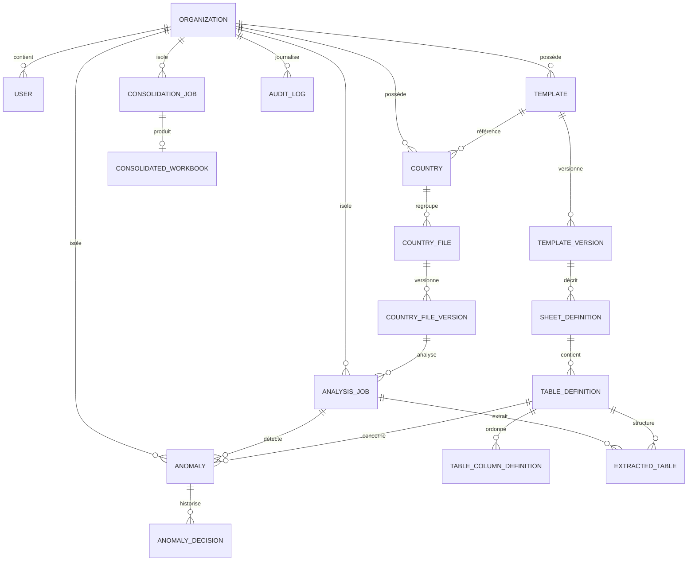

# Modèle de données

## 1. Portée et conventions

Ce document décrit d’abord le **schéma MVP livré par les modèles SQLAlchemy**, puis les renforcements nécessaires pour une exploitation de production. Cette distinction est importante : le MVP possède un compteur `mapping_version`, mais pas encore une table historisant chaque révision de cartographie.

Conventions physiques :

- identifiants : UUID v4 sérialisés en `VARCHAR(36)` ;
- dates : `DateTime(timezone=True)`, produites en UTC et exposées en ISO 8601 ;
- enums : chaînes applicatives afin de conserver la compatibilité SQLite/PostgreSQL ;
- objets flexibles : type SQLAlchemy `JSON` ;
- fichiers : jamais stockés en BLOB, uniquement référencés par `stored_key`, `sha256` et `size_bytes` ;
- noms SQL : `snake_case`; API : alias `camelCase` ;
- clés étrangères : UUID internes, jamais nom de pays, feuille ou fichier.

SQLite est le moteur local par défaut. PostgreSQL est la cible Docker. Les migrations Alembic doivent devenir la source de vérité avant production ; `metadata.create_all()` n’est acceptable que pour un démarrage local ou des tests éphémères.

## 2. Diagramme relationnel



Les relations de consolidation vers les versions pays sélectionnées sont actuellement conservées dans `request_options`/`report`. Une table de jointure typée est proposée en section 10.

## 3. Référentiel d’identité et multi-organisation

### 3.1 `Organization` → `organizations`

| Champ | Type / nullabilité | Règle |
|---|---|---|
| `id` | UUID, PK | généré côté serveur ; |
| `slug` | `VARCHAR(120)`, non nul | identifiant lisible, unique globalement et indexé ; |
| `name` | `VARCHAR(200)`, non nul | nom affiché ; |
| `created_at` | datetime UTC, non nul | date de création. |

Index/contraintes : PK `id`; unicité/index `slug`.

Le principal MVP peut auto-créer une organisation depuis `X-Organization-Id`. Ce comportement est réservé à l’environnement de démonstration.

### 3.2 `User` → `users`

| Champ | Type / nullabilité | Règle |
|---|---|---|
| `id` | UUID, PK | généré côté serveur ; |
| `organization_id` | UUID, FK, non nul | référence `organizations.id` ; |
| `external_id` | `VARCHAR(200)`, non nul | valeur de `X-User-Id` dans le MVP, subject OIDC à terme ; |
| `email` | `VARCHAR(320)`, nullable | information de profil ; |
| `display_name` | `VARCHAR(200)`, nullable | nom affiché ; |
| `created_at` | datetime UTC, non nul | date de création. |

Index/contraintes : index `organization_id`; unicité `(organization_id, external_id)`.

Il n’existe ni mot de passe ni secret utilisateur dans ce modèle. Les rôles et appartenances multiples sont une évolution.

## 4. Template et cartographie

### 4.1 `Template` → `templates`

Agrégat logique représentant le modèle POPS au fil de ses versions binaires.

| Champ | Type / nullabilité | Règle |
|---|---|---|
| `id` | UUID, PK | identifiant public ; |
| `organization_id` | UUID, FK, non nul | propriétaire tenant ; |
| `name` | `VARCHAR(255)`, non nul | nom fonctionnel ; |
| `latest_version` | entier, non nul, défaut `0` | dernier numéro binaire attribué ; |
| `created_by_id` | UUID, FK, non nul | utilisateur créateur ; |
| `created_at` | datetime UTC, non nul | création ; |
| `updated_at` | datetime UTC, non nul | dernière modification. |

Index/contraintes : index `organization_id`; unicité `(organization_id, name)`.

### 4.2 `TemplateVersion` → `template_versions`

Version immuable du fichier de référence ; ses définitions de cartographie restent modifiables dans le MVP.

| Champ | Type / nullabilité | Règle |
|---|---|---|
| `id` | UUID, PK | identifiant de version ; |
| `template_id` | UUID, FK, non nul | parent `templates.id` ; |
| `version` | entier, non nul | numéro du binaire, croissant par template ; |
| `mapping_version` | entier, non nul, défaut `1` | compteur de mutations de la cartographie courante ; |
| `original_filename` | `VARCHAR(255)`, non nul | métadonnée d’affichage, jamais chemin ; |
| `stored_key` | `VARCHAR(700)`, non nul | clé interne unique de stockage ; |
| `sha256` | `CHAR/VARCHAR(64)`, non nul | hash hexadécimal du binaire ; |
| `size_bytes` | entier, non nul | taille compressée ; |
| `sheet_count` | entier, non nul | nombre de feuilles inspectées ; |
| `status` | `VARCHAR(40)`, non nul | état d’import/cartographie, défaut `IMPORTED` ; |
| `workbook_metadata` | JSON, non nul | dimensions, propriétés et avertissements globaux ; |
| `imported_by_id` | UUID, FK, non nul | importateur ; |
| `imported_at` | datetime UTC, non nul | date d’import. |

Index/contraintes : index `template_id`; index `sha256`; unicité `(template_id, version)`; unicité `stored_key`.

Le hash n’est pas unique globalement : le même fichier peut être importé dans plusieurs organisations sans créer un canal d’information inter-tenant.

### 4.3 `SheetDefinition` → `sheet_definitions`

| Champ | Type / nullabilité | Règle |
|---|---|---|
| `id` | UUID, PK | identifiant ; |
| `template_version_id` | UUID, FK, non nul | version inspectée ; |
| `name` | `VARCHAR(255)`, non nul | nom exact d’origine ; |
| `original_index` | entier, non nul | ordre zéro-based interne ; l’API l’expose tel quel de manière documentée ; |
| `visibility` | `VARCHAR(30)`, non nul | `visible`, `hidden` ou `veryHidden` tel qu’inspecté ; |
| `max_row`, `max_column` | entiers, non nuls | dimensions utilisées constatées ; |
| `ignored` | booléen, non nul | décision explicite « sans tableau utile » ; |
| `mapping_status` | `VARCHAR(40)`, non nul | défaut `PENDING`, puis état de configuration ; |
| `merged_ranges` | JSON liste | plages fusionnées ; |
| `formula_cells` | JSON liste | coordonnées et formules structurelles inspectées ; |
| `native_tables` | JSON liste | tables Excel natives ; |
| `named_ranges` | JSON liste | noms/plages définis ; |
| `structural_signature` | JSON objet | empreinte utilisée pour les rapprochements. |

Index/contraintes : index `template_version_id`; unicité `(template_version_id, name)`.

La relation `TemplateVersion.sheets` est ordonnée par `original_index`. Une feuille renommée dans un fichier pays ne modifie jamais cette définition.

### 4.4 `TableDefinition` → `table_definitions`

| Champ | Type / nullabilité | Règle |
|---|---|---|
| `id` | UUID, PK | identifiant stable de la table ; |
| `sheet_definition_id` | UUID, FK, non nul | feuille parente ; |
| `name` | `VARCHAR(255)`, non nul | nom fonctionnel ; |
| `range_ref` | `VARCHAR(60)`, non nul | plage A1 rectangulaire, ex. `B7:H24` ; |
| `header_rows` | JSON liste d’entiers | lignes d’en-tête ; |
| `data_start_row` | entier, non nul | première ligne de données ; |
| `data_end_row` | entier, nullable | fin fixe ; |
| `data_end_rule` | JSON, nullable | règle dynamique si la fin n’est pas fixe ; |
| `key_columns` | JSON liste | colonnes Excel d’identifiant/libellé ; |
| `value_columns` | JSON liste | colonnes de valeur ; |
| `total_rows` | JSON liste | lignes de total ; |
| `computed_columns` | JSON liste | colonnes calculées ; |
| `structure_mode` | `VARCHAR(30)` | `STRICT` ou `SEMI_DYNAMIC` ; |
| `required` | booléen | table obligatoire ou facultative ; |
| `variable_rows` | JSON liste | lignes autorisées à varier ; |
| `variable_columns` | JSON liste | colonnes autorisées à varier ; |
| `ignored_rows` | JSON liste | lignes exclues de la comparaison ; |
| `ignored_columns` | JSON liste | colonnes exclues ; |
| `required_cells` | JSON liste | coordonnées/valeurs structurelles obligatoires ; |
| `required_formulas` | JSON liste | coordonnées/formules obligatoires ; |
| `tolerate_blank_rows_columns` | booléen | tolérance explicite aux axes entièrement vides ; |
| `orientation` | `VARCHAR(20)` | `ROWS` ou `COLUMNS` ; |
| `status` | `VARCHAR(30)` | `DRAFT`, `VALIDATED` ou `REJECTED` ; |
| `signature` | JSON objet | signature canonique pour relocalisation ; |
| `created_by_id` | UUID, FK | auteur ; |
| `created_at`, `updated_at` | datetimes UTC | audit temporel. |

Index/contraintes actuels : index `sheet_definition_id`. Unicité du nom dans la feuille et non-chevauchement éventuel des plages sont validés au niveau applicatif, pas par SQL.

Validation minimale : plage A1 valide ; en-têtes avant `data_start_row`; `data_end_row >= data_start_row` ou `data_end_rule` présente ; colonnes normalisées en majuscules ; rôle des colonnes cohérent.

### 4.5 `TableColumnDefinition` → `table_column_definitions`

| Champ | Type / nullabilité | Règle |
|---|---|---|
| `id` | UUID, PK | identifiant ; |
| `table_definition_id` | UUID, FK, non nul | table parente ; |
| `excel_column` | `VARCHAR(5)`, non nul | lettre de colonne source ; |
| `name` | `VARCHAR(255)`, non nul | libellé choisi ; |
| `normalized_name` | `VARCHAR(255)`, non nul | libellé canonique comparé ; |
| `data_type` | `VARCHAR(40)`, non nul | type estimé/déclaré, défaut `unknown` ; |
| `role` | `VARCHAR(30)`, non nul | `KEY`, `VALUE`, `CALCULATED`, `LABEL` ou `IGNORE` ; |
| `ordinal` | entier, non nul | ordre attendu ; |
| `required` | booléen, non nul | présence obligatoire. |

Index/contraintes : index `table_definition_id`; unicité `(table_definition_id, excel_column)`.

### 4.6 Versionnement de cartographie du MVP

Le modèle livré ne contient pas `MappingRevision`. La cartographie courante est la composition :

```text
TemplateVersion.mapping_version
  + SheetDefinition[*]
  + TableDefinition[*]
  + TableColumnDefinition[*]
```

Toute mutation significative doit incrémenter atomiquement `mapping_version`, dans la même transaction que la définition modifiée. L’export de cartographie contient ce numéro et `TemplateVersion.sha256`.

**Limite connue :** un compteur n’est pas un historique. Si la cartographie passe de 2 à 3, l’état exact de la version 2 ne peut pas être reconstruit à partir des seules tables actuelles. Avant une utilisation réglementée ou des analyses longues concurrentes, ajouter la cible décrite en section 10.1.

## 5. Pays et fichiers

### 5.1 `Country` → `countries`

| Champ | Type / nullabilité | Règle |
|---|---|---|
| `id` | UUID, PK | identifiant ; |
| `organization_id` | UUID, FK, non nul | tenant ; |
| `name` | `VARCHAR(255)`, non nul | nom affiché ; |
| `code` | `VARCHAR(30)`, nullable | code libre, éventuellement ISO ; |
| `template_id` | UUID, FK, non nul | template logique associé ; |
| `status` | `VARCHAR(40)`, non nul | statut synthétique du dernier contrôle ; |
| `created_by_id` | UUID, FK, non nul | créateur ; |
| `created_at`, `updated_at` | datetimes UTC | dates. |

Index/contraintes : index `organization_id`; index `template_id`; unicité `(organization_id, name)`. Le code n’est pas unique dans le MVP.

### 5.2 `CountryFile` → `country_files`

Conteneur logique d’une série de versions pour un pays.

| Champ | Type / nullabilité | Règle |
|---|---|---|
| `id` | UUID, PK | identifiant du flux ; |
| `country_id` | UUID, FK, non nul | pays ; |
| `latest_version` | entier, non nul, défaut `0` | dernier numéro attribué ; |
| `created_at` | datetime UTC, non nul | création du flux. |

Index/contraintes : index `country_id`. Le schéma autorise actuellement plusieurs `CountryFile` par pays ; si le produit retient un seul flux par pays/template, ajouter une contrainte unique après migration des données.

### 5.3 `CountryFileVersion` → `country_file_versions`

| Champ | Type / nullabilité | Règle |
|---|---|---|
| `id` | UUID, PK | identifiant de l’import réellement analysé ; |
| `country_file_id` | UUID, FK, non nul | flux parent ; |
| `version` | entier, non nul | numéro croissant dans le flux ; |
| `original_filename` | `VARCHAR(255)`, non nul | affichage uniquement ; |
| `stored_key` | `VARCHAR(700)`, non nul | clé interne unique ; |
| `sha256` | `VARCHAR(64)`, non nul | hash du binaire ; |
| `size_bytes` | entier, non nul | taille ; |
| `status` | `VARCHAR(40)`, non nul | `IMPORTED`, `ANALYZING`, résultat ou erreur ; |
| `workbook_metadata` | JSON objet | inspection du fichier pays ; |
| `imported_by_id` | UUID, FK, non nul | utilisateur ; |
| `imported_at` | datetime UTC, non nul | date d’import. |

Index/contraintes : index `country_file_id`; index `sha256`; unicité `(country_file_id, version)`; unicité `stored_key`.

Le fichier est immuable. Un nouvel upload, même de contenu identique, peut créer une nouvelle version pour préserver l’intention et l’audit ; une clé d’idempotence HTTP évite uniquement les doublons de transport.

## 6. Analyse, anomalies et extraction

### 6.1 `AnalysisJob` → `analysis_jobs`

| Champ | Type / nullabilité | Règle |
|---|---|---|
| `id` | UUID, PK | identifiant de job ; |
| `organization_id` | UUID, FK, non nul | tenant explicite ; |
| `file_version_id` | UUID, FK, non nul | version pays analysée ; |
| `status` | `VARCHAR(30)`, non nul | `PENDING`, `RUNNING`, `COMPLETED`, `FAILED` ; |
| `progress` | entier, non nul | pourcentage 0–100 ; |
| `report` | JSON objet | synthèse, références utilisées, statistiques ; |
| `error_log` | JSON liste | erreurs sûres et structurées ; |
| `requested_by_id` | UUID, FK, non nul | demandeur ; |
| `created_at` | datetime UTC | création ; |
| `started_at`, `completed_at` | datetime UTC, nullable | exécution. |

Index/contraintes : index `organization_id`; index `file_version_id`.

**Écart de reproductibilité MVP :** il n’existe pas de colonnes FK `template_version_id` ni `mapping_revision_id`. Le rapport doit au minimum enregistrer `templateVersionId`, `mappingVersion`, `workbookHash` et `engineVersion`. Une FK vers un snapshot immuable est la cible.

### 6.2 `Anomaly` → `anomalies`

| Champ | Type / nullabilité | Règle |
|---|---|---|
| `id` | UUID, PK | identifiant ; |
| `organization_id` | UUID, FK, non nul | tenant explicite ; |
| `analysis_job_id` | UUID, FK, non nul | rapport source ; |
| `country_id` | UUID, FK, non nul | pays ; |
| `file_version_id` | UUID, FK, non nul | version concernée ; |
| `sheet_name` | `VARCHAR(255)`, nullable | feuille constatée/attendue ; |
| `table_definition_id` | UUID, FK, nullable | table cartographiée ; |
| `table_name` | `VARCHAR(255)`, nullable | snapshot lisible du nom ; |
| `category` | `VARCHAR(60)`, non nul | catégorie normalisée ; |
| `severity` | `VARCHAR(30)`, non nul | `BLOCKING`, `ERROR`, `WARNING`, `INFO` ; |
| `description` | texte, non nul | message métier ; |
| `expected`, `actual` | JSON, nullable | structures/valeurs sérialisées ; |
| `expected_coordinates`, `actual_coordinates` | `VARCHAR(100)`, nullable | plages/cellules A1 ; |
| `suggestion` | texte, nullable | action humaine suggérée ; |
| `status` | `VARCHAR(40)`, non nul | statut de traitement ; |
| `confidence` | flottant, nullable | score de correspondance 0–1 ; |
| `match_reasons` | JSON liste | explications ; |
| `candidates` | JSON liste | alternatives ambiguës ; |
| `expected_preview`, `actual_preview` | JSON, nullable | vues structurées bornées ; |
| `created_at`, `updated_at` | datetimes UTC | dates. |

Index/contraintes : index individuels sur `organization_id`, `analysis_job_id`, `country_id`, `file_version_id`, `sheet_name`, `table_definition_id`, `category`, `severity`; index composé `(organization_id, category, severity, status)`.

Catégories supportées :

- classeur : `SHEET_MISSING`, `SHEET_ADDED`, `SHEET_RENAMED`, `SHEET_ORDER_CHANGED`, `SHEET_VISIBILITY_CHANGED` ;
- table : `TABLE_MISSING`, `TABLE_MOVED`, `TABLE_RANGE_CHANGED`, `COLUMN_ADDED`, `COLUMN_REMOVED`, `COLUMN_RENAMED`, `COLUMN_ORDER_CHANGED`, `ROW_ADDED`, `ROW_REMOVED`, `ROW_ORDER_CHANGED`, `HEADER_CHANGED`, `KEY_CELL_CHANGED`, `FORMULA_MISSING`, `FORMULA_CHANGED`, `MERGED_CELL_CHANGED` ;
- technique : `FILE_CORRUPTED`, `UNSUPPORTED_FORMAT`, `UNREADABLE_SHEET`, `AMBIGUOUS_TABLE_MATCH`, `EXTRACTION_FAILED`.

Statuts : `NEW`, `CONFIRMED`, `FALSE_POSITIVE`, `ACCEPTED_EXCEPTION`, `FIXED`.

### 6.3 `AnomalyDecision` → `anomaly_decisions`

| Champ | Type / nullabilité | Règle |
|---|---|---|
| `id` | UUID, PK | identifiant ; |
| `anomaly_id` | UUID, FK, non nul | anomalie ; |
| `previous_status` | `VARCHAR(40)`, non nul | état avant décision ; |
| `decision` | `VARCHAR(40)`, non nul | nouvel état ; |
| `comment` | texte, nullable | justification ; |
| `decided_by_id` | UUID, FK, non nul | acteur ; |
| `created_at` | datetime UTC, non nul | date. |

Index/contraintes : index `anomaly_id`. Les décisions sont append-only ; modifier une qualification ajoute une ligne.

### 6.4 `ExtractedTable` → `extracted_tables`

Cette entité additionnelle matérialise l’extraction structurée requise par le module 2.

| Champ | Type / nullabilité | Règle |
|---|---|---|
| `id` | UUID, PK | identifiant ; |
| `analysis_job_id` | UUID, FK, non nul | job ; |
| `country_id` | UUID, FK, non nul | pays ; |
| `table_definition_id` | UUID, FK, non nul | définition utilisée ; |
| `sheet_name`, `table_name` | `VARCHAR(255)`, non nuls | contexte lisible ; |
| `source_range` | `VARCHAR(100)`, non nul | plage constatée ; |
| `headers` | JSON liste | en-têtes normalisés ; |
| `rows` | JSON liste | lignes et valeurs ; |
| `cell_coordinates` | JSON matrice | coordonnées A1 ; |
| `formulas` | JSON liste | formules textuelles ; |
| `warnings` | JSON liste | avertissements associés. |

Index/contraintes : index `analysis_job_id`, `country_id`, `table_definition_id`.

Le stockage JSON en base convient aux jeux de démonstration bornés. Pour de gros tableaux, déplacer `rows`, coordonnées et formules vers un artefact objet JSON/Parquet et ne garder ici que son URI interne, son hash et son schéma.

## 7. Consolidation

### 7.1 `ConsolidationJob` → `consolidation_jobs`

| Champ | Type / nullabilité | Règle |
|---|---|---|
| `id` | UUID, PK | identifiant ; |
| `organization_id` | UUID, FK, non nul | tenant ; |
| `status` | `VARCHAR(30)`, non nul | état de job ; |
| `progress` | entier, non nul | 0–100 ; |
| `request_options` | JSON objet | sélection et options figées ; |
| `report` | JSON objet | inclusions, exclusions, noms, warnings, erreurs ; |
| `error_message` | texte, nullable | erreur terminale sûre ; |
| `requested_by_id` | UUID, FK, non nul | demandeur ; |
| `created_at`, `started_at`, `completed_at` | datetimes UTC | cycle de vie. |

Index/contraintes : index `organization_id`.

### 7.2 `ConsolidatedWorkbook` → `consolidated_workbooks`

| Champ | Type / nullabilité | Règle |
|---|---|---|
| `id` | UUID, PK | identifiant du résultat ; |
| `consolidation_job_id` | UUID, FK, non nul | relation 1–0/1 avec le job ; |
| `stored_key` | `VARCHAR(700)`, non nul | objet final unique ; |
| `filename` | `VARCHAR(255)`, non nul | nom de téléchargement contrôlé ; |
| `sha256` | `VARCHAR(64)`, non nul | intégrité ; |
| `size_bytes` | entier, non nul | taille ; |
| `created_at` | datetime UTC, non nul | publication. |

Index/contraintes : unicité/index `consolidation_job_id`; unicité `stored_key`.

La correspondance `{country, originalSheetName, consolidatedSheetName}` se trouve dans `ConsolidationJob.report` dans le MVP. Une table typée est préférable si elle doit être requêtée ou auditée indépendamment.

## 8. Audit

### 8.1 `AuditLog` → `audit_logs`

| Champ | Type / nullabilité | Règle |
|---|---|---|
| `id` | UUID, PK | identifiant ; |
| `organization_id` | UUID, FK, non nul | tenant ; |
| `user_id` | UUID, FK, non nul | acteur ; |
| `action` | `VARCHAR(80)`, non nul | verbe normalisé ; |
| `entity_type` | `VARCHAR(80)`, non nul | type d’agrégat ; |
| `entity_id` | UUID, non nul | ressource concernée ; |
| `details` | JSON objet | contexte sûr, sans contenu sensible massif ; |
| `created_at` | datetime UTC, non nul | date. |

Index/contraintes : index individuels `organization_id`, `user_id`, `action`; index composé `(organization_id, created_at)`.

Événements minimaux : `TEMPLATE_IMPORTED`, `TABLE_RANGE_CHANGED`, `TABLE_VALIDATED`, `COUNTRY_FILE_IMPORTED`, `ANALYSIS_STARTED`, `ANOMALY_DECIDED`, `CONSOLIDATION_STARTED`, `CONSOLIDATION_DOWNLOADED`.

Le journal est append-only au niveau applicatif. Une cible réglementée ajoutera une rétention dédiée, une protection contre l’altération et éventuellement un export SIEM.

## 9. Isolation tenant et intégrité

### 9.1 Règle d’appartenance

Les racines `Template` et `Country` portent directement `organization_id`. Leurs enfants héritent de l’organisation par la chaîne de relations. Les entités fréquemment filtrées (`AnalysisJob`, `Anomaly`, `ConsolidationJob`, `AuditLog`) portent aussi `organization_id` pour des requêtes sûres et efficaces.

Un repository doit commencer sa requête depuis une racine tenant-aware ou ajouter explicitement `organization_id = :principal_organization_id`. Il est interdit de charger une ressource par son seul `id` puis de vérifier après mutation.

### 9.2 Limite de contrainte du MVP

Les FK simples actuelles n’empêchent pas à elles seules une incohérence telle qu’un `Anomaly.organization_id` différent de celui de son `AnalysisJob`. Le service doit valider la cohérence dans la transaction.

Renforcement production recommandé :

- clés/contraintes composites `(organization_id, id)` sur les agrégats ;
- FK composites sur les relations tenant-aware ;
- `CHECK` sur les enums et pourcentages ;
- PostgreSQL RLS comme défense en profondeur ;
- activation explicite de `PRAGMA foreign_keys=ON` sous SQLite ;
- tests de non-régression d’accès croisé.

### 9.3 Concurrence

`Template.latest_version` et `CountryFile.latest_version` doivent être incrémentés sous verrou/transaction. PostgreSQL utilise un verrou de ligne ou une séquence par agrégat ; SQLite sérialise l’écriture et doit gérer les retries `database is locked`.

Le compteur `mapping_version` doit servir à l’optimistic locking : le client envoie la version lue ; une mutation concurrente retourne `409 MAPPING_VERSION_CONFLICT`. Les modèles ne possèdent pas encore de colonne `row_version` générique.

## 10. Évolutions du schéma

### 10.1 Historique immuable de cartographie — priorité production

Ajouter :

```text
MappingRevision(
  id UUID PK,
  organization_id UUID FK,
  template_version_id UUID FK,
  revision_number INT,
  status DRAFT|PUBLISHED|ARCHIVED,
  snapshot JSON ou stored_key,
  sha256 CHAR(64),
  created_by_id UUID FK,
  created_at TIMESTAMPTZ,
  published_at TIMESTAMPTZ NULL,
  UNIQUE(template_version_id, revision_number)
)
```

`AnalysisJob` reçoit `template_version_id`, `mapping_revision_id`, `engine_version` et `options_snapshot`. Une cartographie publiée devient immuable ; une correction clone un nouveau brouillon.

### 10.2 Sources de consolidation normalisées

Ajouter `ConsolidationSource(job_id, country_id, file_version_id, analysis_job_id, inclusion_status, exclusion_reason, ordinal)` avec unicité `(job_id, file_version_id)`. Ajouter `ConsolidatedSheet(job_id, source_id, original_name, consolidated_name, original_index, status, warnings)`.

### 10.3 Artefacts et stockage

Ajouter `StoredObject(id, organization_id, provider, key, sha256, size_bytes, media_type, state, retention_until, created_at)` et remplacer progressivement les `stored_key` libres par des FK. Cela facilite S3, la rétention, le chiffrement, la réconciliation et la suppression sûre.

### 10.4 Exécution distribuée

Ajouter à chaque job : `task_type`, `phase`, `attempt`, `max_attempts`, `lease_owner`, `lease_expires_at`, `heartbeat_at`, `cancel_requested_at`, `engine_version`, `idempotency_key` et `trace_id`. Une table outbox transactionnelle publie les tâches.

### 10.5 Autorisation

Ajouter `Role`, `OrganizationMembership` et éventuellement `Permission`, au lieu d’un unique rattachement direct de `User` à une organisation. L’identité OIDC conserve son `issuer` et son `subject` avec unicité `(issuer, subject)`.

## 11. Index recommandés avant volumétrie réelle

À valider avec `EXPLAIN` sur PostgreSQL et des données représentatives :

- `template_versions(template_id, imported_at DESC)` ;
- `sheet_definitions(template_version_id, original_index)` ;
- `table_definitions(sheet_definition_id, status)` ;
- `countries(organization_id, status)` ;
- `country_files(country_id, created_at DESC)` ;
- `country_file_versions(country_file_id, version DESC)` ;
- `analysis_jobs(organization_id, status, created_at DESC)` ;
- `analysis_jobs(file_version_id, created_at DESC)` ;
- `anomalies(organization_id, country_id, severity, status)` ;
- `anomalies(analysis_job_id, severity)` ;
- `anomaly_decisions(anomaly_id, created_at DESC)` ;
- `consolidation_jobs(organization_id, created_at DESC)` ;
- `audit_logs(organization_id, entity_type, entity_id, created_at DESC)`.

Ne pas indexer les champs JSON par défaut. Sur PostgreSQL, ajouter des index GIN seulement pour des chemins réellement filtrés et stables.

## 12. Rétention et suppression

- Les sources, versions et rapports sont immuables tant qu’ils sont référencés.
- Une suppression fonctionnelle doit d’abord rendre la ressource inaccessible, écrire un audit, puis purger les objets selon la politique de rétention.
- Un objet ne peut être supprimé si un rapport, une consolidation ou un audit l’exige encore.
- Les suppressions en cascade ORM conviennent aux tests, mais une purge de production doit être un cas d’usage explicite et idempotent.
- Les temporaires ont une durée courte configurable et ne sont jamais référencés comme résultat final.
- Une restauration vérifie `stored_key`, taille et SHA-256 pour chaque objet critique.

## 13. Matrice entité / périmètre

| Entité | MVP livré | Évolution |
|---|---:|---|
| `Organization`, `User` | oui | memberships, rôles, OIDC |
| `Template`, `TemplateVersion` | oui | politique d’activation/archivage |
| `SheetDefinition`, `TableDefinition`, `TableColumnDefinition` | oui | snapshots immuables |
| `MappingRevision` | non, compteur seulement | priorité production |
| `Country`, `CountryFile`, `CountryFileVersion` | oui | quotas/rétention avancée |
| `AnalysisJob`, `Anomaly`, `AnomalyDecision` | oui | retry, lease, moteur versionné |
| `ExtractedTable` | oui | artefact Parquet/warehouse |
| `ConsolidationJob`, `ConsolidatedWorkbook` | oui | sources et feuilles normalisées |
| `AuditLog` | oui | journal inviolable/SIEM |
| `StoredObject` | non, `stored_key` actuel | stockage S3 et lifecycle |
