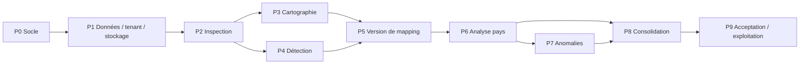

# Plan d’implémentation du MVP

## 1. Principes de conduite

Le plan suit l’ordre métier du cahier des charges tout en sécurisant d’abord les fondations transverses. Chaque phase livre un incrément testable de bout en bout ; une phase n’est terminée que lorsque ses migrations, validations backend/frontend, tests, audit et messages utilisateur sont présents.

Ce document distingue :

- **MVP** : phases P0 à P9, correspondant aux 20 critères d’acceptation ;
- **durcissement production** : prérequis identifiés qui dépassent la démonstration locale, notamment OIDC et snapshots de cartographie ;
- **évolutions** : phase E1+, non nécessaires à l’acceptation du lot.

Le tableau d’acceptation décrit les preuves attendues ; il ne prétend pas que l’implémentation a déjà passé ces preuves.

## 2. Découpage des phases

### P0 — Cadrage, contrats et squelette du monorepo

Objectif : obtenir un socle exécutable et des conventions stables.

Livrables :

- hypothèses, architecture, modèle et API validés ;
- monorepo `frontend/`, `backend/`, `docs/` ;
- React/Vite/TypeScript strict et FastAPI ;
- configuration centralisée, `.env.example`, logs et gestion d’erreurs ;
- scripts de lint, typecheck, tests et build ;
- Docker Compose avec API, frontend et PostgreSQL ;
- SQLite par défaut pour le lancement local.

Sortie de phase : healthcheck opérationnel, build frontend et import Python réussis, procédure de lancement reproductible.

### P1 — Données, stockage, principal et audit

Objectif : rendre toute donnée persistante, tenant-aware et traçable avant le traitement Excel.

Livrables MVP :

- modèles SQLAlchemy décrits dans `DATA_MODEL.md` ;
- migrations Alembic pour SQLite et PostgreSQL ;
- `ObjectStorage` et adaptateur local avec clés générées serveur ;
- arborescence `organizations/{organizationId}/...` ;
- principal de démonstration via `X-Organization-Id`, `X-User-Id` et API key optionnelle ;
- repositories filtrés par organisation ;
- `AuditLog` pour les événements importants ;
- nettoyage des temporaires et gestion transactionnelle des erreurs.

Sortie de phase : tests d’isolation inter-organisation, migration up/down sur base jetable, écriture/lecture/hash d’un objet sans utiliser son nom client.

Limite acceptée : l’identité par en-têtes/API key reste strictement locale/démonstration. OIDC est un prérequis de production.

### P2 — Sécurité d’upload et inspection Excel

Objectif : importer un `.xlsx` sans exécuter de contenu actif et produire un snapshot exploitable.

Livrables MVP :

- contrôle extension, signature ZIP OOXML et parties requises ;
- limites de taille, nombre d’entrées, taille décompressée et ratio ;
- rejet Zip Slip, chiffrement et VBA ;
- avertissement pour liens externes, ActiveX et objets intégrés ;
- SHA-256, nom d’origine, taille et stockage immuable ;
- inspection `openpyxl` : feuilles ordonnées, visibilité, dimensions, fusions, formules, tables natives et noms définis ;
- persistance `Template`, `TemplateVersion`, `SheetDefinition` ;
- API d’import, liste, détail, feuilles et fenêtres de grille ;
- générateurs de classeurs de test.

Sortie de phase : un template synthétique multi-feuilles s’importe et se réouvre ; un faux `.xlsx`, un ZIP malveillant et un classeur corrompu sont refusés avec une erreur métier.

### P3 — Cartographie manuelle et grille web

Objectif : rendre possible une cartographie autonome sans complément Excel.

Livrables MVP :

- page `/templates/:id/mapping` desktop-first ;
- liste de feuilles, grille bornée et défilable, coordonnées, zoom, formules/fusions visibles ; la virtualisation complète reste une optimisation future ;
- sélection de plage et plusieurs tables par feuille ;
- panneau de configuration complet pour modes `STRICT`/`SEMI_DYNAMIC` ;
- `TableDefinition` et `TableColumnDefinition` ;
- création, modification, validation et rejet ;
- feuille marquée explicitement ignorée ;
- progression dérivée ;
- validations identiques côté formulaire et API.

Sortie de phase : une feuille avec deux tables peut être cartographiée, chaque définition est relue après rafraîchissement, et une feuille ignorée compte comme configurée.

### P4 — Détection semi-automatique et prévisualisation

Objectif : accélérer la cartographie tout en maintenant la décision humaine.

Livrables MVP :

- segmentation des blocs non vides ;
- signaux : densité, séparateurs vides, styles, bordures, fonds, gras, types, fusions, formules répétées, tables natives et noms définis ;
- score 0–1, raisons et aperçu pour chaque candidat ;
- déduplication géométrique des candidats ;
- actions accepter/modifier/rejeter/ajouter ;
- prévisualisation structurée : en-têtes, types, données, coordonnées, vides, doublons de clés, totaux ;
- aucun passage automatique à `VALIDATED`.

Sortie de phase : les candidats sont déterministes sur les fixtures, une proposition modifiée devient une table explicite, et le rejet ne supprime pas la possibilité d’une sélection manuelle.

### P5 — Persistance et version de cartographie

Objectif : satisfaire la traçabilité minimale du MVP et préparer la reproductibilité forte.

Livrables MVP :

- `TemplateVersion.mapping_version`, incrément atomique à chaque mutation significative ;
- export JSON avec hash du workbook, version binaire, version de mapping, feuilles et tables ;
- règle de complétude de toutes les feuilles ;
- audit des changements de plage et validations ;
- protection contre les mises à jour tenant-crossing ;
- tests de progression et d’incrément.

Sortie de phase : l’export après mutation porte un `mappingVersion` supérieur et représente exactement l’état courant.

Limite à afficher : le compteur ne permet pas encore de récupérer l’ancien état. Si l’acceptation exige la restauration de toute version antérieure, l’entité/snapshot `MappingRevision` décrite dans `DATA_MODEL.md` doit être avancée dans cette phase au lieu de rester un durcissement production.

### P6 — Pays, imports versionnés et comparaison structurelle

Objectif : analyser une version pays contre la cartographie courante sans modifier sa source.

Livrables MVP :

- création/liste de pays et association au template ;
- `CountryFile` et versions immuables, hash, auteur et historique ;
- création d’un `AnalysisJob`, exécution immédiate et états persistés ;
- comparaison des feuilles : absence, ajout, renommage hypothétique, ordre, visibilité, dimensions, noms définis, fusions et formules ;
- comparaison des tables à la position attendue puis recherche par signature ;
- modes strict et semi-dynamique ;
- lignes/colonnes ajoutées, retirées, renommées ou réordonnées ;
- rapprochement prudent avec score, raisons et candidats ambigus ;
- extraction structurée uniquement si fiable ;
- catégories, sévérités et statuts complets ;
- statut synthétique du pays.

Sortie de phase : chaque fixture structurelle produit les anomalies attendues et aucune extraction n’est créée pour deux candidats similaires.

Limite à afficher : `AnalysisJob` doit exposer dans son rapport le `templateVersionId`, le `mappingVersion`, le hash et la version de moteur. Le snapshot/FK immuable est un durcissement production prioritaire.

### P7 — Dashboard et traitement des anomalies

Objectif : rendre les résultats compréhensibles et actionnables.

Livrables MVP :

- vue globale pays/conformité/anomalies ;
- vue par pays, version et feuille ;
- filtres pays, feuille, table, catégorie, sévérité et statut ;
- vue détaillée attendu/constaté avec coordonnées et suggestions ;
- diff visuel des colonnes/lignes/en-têtes/déplacements ;
- décision `CONFIRMED`, `FALSE_POSITIVE`, `ACCEPTED_EXCEPTION` ou `FIXED` ;
- `AnomalyDecision` append-only et audit ;
- recalcul du statut synthétique.

Sortie de phase : une décision persiste après rafraîchissement, son historique identifie l’acteur, et les compteurs du dashboard sont recalculés.

### P8 — Consolidation et rapport

Objectif : générer explicitement un nouveau classeur global téléchargeable.

Livrables MVP :

- sélection de tous/certains pays, dernières versions et politique de conformité ;
- exclusion par défaut des anomalies bloquantes ;
- résolution figée des sources lors du lancement ;
- normalisation des noms : caractères interdits, suffixe pays, 31 caractères, collisions déterministes ;
- table de correspondance des noms ;
- copieur inter-classeurs au mieux pour cellules, formules, styles, dimensions, fusions, commentaires, hyperliens, zones d’impression et volets ;
- détection et avertissement pour objets non pris en charge et références à risque ;
- contrôle de réouverture du résultat ;
- rapport complet, hash et téléchargement autorisé ;
- aucun changement de hash/taille des sources.

Sortie de phase : les fixtures de noms spéciaux/collisions/31 caractères passent, le classeur généré se rouvre, chaque source conserve son hash et le rapport explique toute perte.

### P9 — Qualité, démonstration et exploitation MVP

Objectif : prouver les 20 critères et rendre le lot reproductible par une autre équipe.

Livrables MVP :

- suite unitaire, intégration, API, frontend et end-to-end ;
- corpus synthétique généré automatiquement ;
- exécution sur SQLite et PostgreSQL ;
- données de démonstration reproductibles ;
- Docker Compose, `.env.example`, migrations et procédure de lancement ;
- documentation des limites `openpyxl`, de la copie et de l’auth MVP ;
- tests de sécurité et isolation tenant ;
- checklist manuelle UI sur résolutions desktop ciblées ;
- rapport final de couverture des 20 critères.

Sortie de phase : toutes les preuves de la matrice ci-dessous sont vertes, aucun secret n’est commité, et un environnement vierge démarre avec la procédure documentée.

## 3. Dépendances et ordre critique

Le frontend de P3/P7 peut être développé sur contrats mockés en parallèle, mais l’intégration n’est validée qu’avec les API et données réelles.

## 4. Matrice des 20 critères d’acceptation

| # | Critère MVP | Phase(s) | Implémentation attendue | Preuve automatisée / vérification |
|---:|---|---|---|---|
| 1 | Un utilisateur peut importer un template `.xlsx`. | P2 | `POST /api/templates`, validation OOXML, stockage immuable et écran `/templates`. | Test API avec `.xlsx` valide → `201`; faux format → `415`; parcours UI d’upload. |
| 2 | Toutes les feuilles sont affichées dans leur ordre d’origine. | P2–P3 | `SheetDefinition.original_index`, relation triée et liste de feuilles. | Fixture multi-feuilles visible/hidden/veryHidden ; assertion exacte ordre/noms/visibilité ; contrôle UI. |
| 3 | L’utilisateur peut sélectionner plusieurs tableaux dans une même feuille. | P3 | sélection de plage et plusieurs `TableDefinition` rattachées au même `SheetDefinition`. | E2E crée deux plages, recharge et retrouve deux tables distinctes. |
| 4 | Le système peut proposer des plages candidates. | P4 | `POST .../tables/detect`, moteur multi-signaux, score/raisons/preview. | Fixtures un et plusieurs blocs ; plages attendues présentes au-dessus du seuil. |
| 5 | Chaque plage peut être modifiée manuellement. | P3–P4 | formulaire et `PUT .../tables/{tableId}` avec validation A1. | Test API puis E2E déplace `B7:H24` vers `B8:H25` et vérifie persistance/incrément mapping. |
| 6 | Le tableau sélectionné est affiché sous forme structurée. | P4 | endpoint preview avec en-têtes, types, lignes, totaux, vides, doublons et coordonnées. | Test snapshot sur fixture connue ; contrôle des coordonnées et formule non évaluée. |
| 7 | L’utilisateur peut valider ou rejeter chaque tableau. | P3–P4 | statuts `DRAFT`, `VALIDATED`, `REJECTED` et actions UI. | Tests de transitions, refus de validation incomplète et vérification UI. |
| 8 | La cartographie complète est enregistrée et versionnée. | P5 | persistance des définitions, `mapping_version` incrémenté et export avec hash. | Test mutation → version N+1 et export identique à l’état courant. Limite historique explicitement documentée. |
| 9 | Un utilisateur peut créer un pays et uploader un fichier POPS. | P6 | `POST /api/countries`, upload pays, `CountryFileVersion`, historique et analyse. | Test API crée pays + deux imports → versions 1/2, hashes et sources présentes. |
| 10 | Le système détecte les principales différences de feuilles, lignes et colonnes. | P6 | comparateurs workbook/table strict et semi-dynamique. | Tests paramétrés feuille ajoutée/supprimée/renommée/ordre ; ligne/colonne ajoutée/supprimée/inversée. |
| 11 | Les anomalies sont affichées par pays, feuille et tableau. | P6–P7 | entité `Anomaly`, endpoints filtrés et listes groupées. | Test filtres et tenant ; E2E navigue pays → feuille → table. |
| 12 | Les structures attendues et constatées peuvent être comparées visuellement. | P7 | `expectedPreview`/`actualPreview` et composant de diff. | Test composant pour ajout/retrait/ordre ; contrôle manuel avec fixture déplacée. |
| 13 | L’utilisateur peut qualifier une anomalie. | P7 | `PATCH /api/anomalies/{id}`, `AnomalyDecision`, audit et recalcul. | Test transition et historique acteur/commentaire ; E2E recharge le statut. |
| 14 | L’utilisateur peut lancer une consolidation. | P8 | page `/consolidation`, `POST /api/consolidations`, job explicite. | Test API prouve qu’un import seul ne consolide pas ; clic utilisateur crée le job. |
| 15 | Chaque feuille consolidée reçoit un suffixe correspondant au pays. | P8 | normaliseur déterministe et table de correspondance. | Ouvrir le résultat et vérifier tous les titres contre les pays sélectionnés. |
| 16 | Les noms de feuilles respectent la limite Excel de 31 caractères. | P8 | nettoyage, troncature et suffixe de collision. | Tests nom long, caractères `[]:*?/\\`, accents, collisions ; `len(title) <= 31` et unicité. |
| 17 | Le fichier consolidé est téléchargeable. | P8 | artefact final, endpoint download et en-têtes sûrs. | Test HTTP `200`, MIME, disposition, SHA-256, puis réouverture avec `openpyxl`. |
| 18 | Les fichiers originaux restent inchangés. | P1–P2–P6–P8 | stockage immuable et écriture dans un nouvel objet. | Comparer SHA-256 et taille de chaque source avant/après analyse/consolidation. |
| 19 | Les erreurs et limites de copie sont présentées clairement. | P8–P9 | rapport, warnings et UI sans stack trace. | Fixtures objet/lien externe simulé ; rapport contient catégorie, feuille, message et suggestion. |
| 20 | Les principales fonctions sont couvertes par des tests automatisés. | P2–P9 | pyramide de tests et corpus généré. | Pipeline exécute backend/frontend/E2E, publie résultats et échoue sur toute régression critique. |

## 5. Corpus de tests reproductible

Les fixtures `.xlsx` sont générées par code dans un répertoire temporaire. Aucun test ne dépend d’Excel installé ou d’un fichier manuel non versionné.

| Groupe | Fixtures minimales | Assertions clés |
|---|---|---|
| Lecture | une feuille ; plusieurs feuilles ; visibles/masquées/très masquées ; fusions ; formules | ordre, visibilité, dimensions, formule textuelle, fusions |
| Cartographie | plusieurs tableaux dans une feuille ; plage manuelle ; table native ; nom défini | candidats, sélection, preview, validation |
| Feuilles | supprimée ; ajoutée ; renommée ; ordre modifié ; visibilité modifiée | catégories, sévérité, hypothèse de renommage |
| Colonnes | ajoutée ; supprimée ; inversées ; en-tête renommé | strict/semi-dynamique, attendu/constaté |
| Lignes | ajoutée ; supprimée ; inversées ; ligne variable | politiques et anomalies |
| Formules | supprimée ; modifiée ; déplacée ; lien inter-feuilles | comparaison textuelle et avertissement |
| Rapprochement | tableau déplacé ; introuvable ; deux zones similaires | `TABLE_MOVED`, `TABLE_MISSING`, ambiguïté sans extraction |
| Consolidation | pays avec caractères spéciaux ; nom >31 ; collisions ; plusieurs pays | noms valides/uniques, suffixes, ordre, rapport |
| Robustesse | fichier corrompu ; format non supporté ; faux ZIP ; ZIP path traversal ; ratio suspect | codes HTTP/métier et absence de fichier final |
| Sécurité | deux organisations utilisant des UUID connus | aucune lecture, mutation ou download croisé |

Pour les styles et objets complexes, les tests vérifient à la fois les propriétés copiées promises et la présence d’un avertissement pour celles qui ne le sont pas.

## 6. Stratégie de validation par couche

### Backend

- unitaires rapides pour fonctions pures ;
- intégration avec base réelle et stockage temporaire ;
- API via client ASGI ;
- tests PostgreSQL dédiés aux verrous, JSON et migrations ;
- mesure de mémoire/durée sur un classeur proche des limites configurées.

### Frontend

- tests de composants accessibles ;
- tests des formulaires et erreurs API ;
- tests du cache/polling des jobs ;
- E2E du parcours complet ;
- build TypeScript strict sans erreur.

### Contrat et end-to-end

- exemples `API.md` validés contre les schémas lorsque possible ;
- parcours template → mapping → pays → analyse → décision → consolidation ;
- test Docker sur environnement vierge ;
- test de migration d’une version de schéma précédente.

## 7. Portes de qualité

Une livraison candidate MVP doit satisfaire simultanément :

1. les 20 lignes de la matrice disposent d’une preuve verte ;
2. aucune anomalie bloquante de sécurité/tenant n’est ouverte ;
3. tests, lint, typecheck et builds réussissent ;
4. migrations montantes réussissent sur SQLite et PostgreSQL ;
5. sources importées inchangées par hash ;
6. consolidations de référence lisibles et accompagnées de leur rapport ;
7. logs et erreurs UI ne contiennent ni stack trace, ni secret, ni chemin local ;
8. `.env.example`, Docker et données de démonstration fonctionnent depuis un clone vierge ;
9. limites connues d’`openpyxl`, de l’auth et du versionnement de mapping sont visibles ;
10. sauvegarde/restauration et purge des temporaires ont au moins une procédure testée.

## 8. Risques et traitements

| Risque | Impact | Traitement MVP | Décision d’évolution |
|---|---|---|---|
| Classeur très grand | mémoire/timeout du processus API | limites strictes, fenêtre de grille, mesure et refus clair | worker isolé + streaming |
| ZIP malveillant | déni de service/path traversal | prévalidation avant `openpyxl` | antivirus/sandbox |
| Faux rapprochement | extraction incorrecte | seuil, marge, raisons, ambiguïté bloquante | calibration/ML supervisé |
| Cartographie modifiée pendant une analyse | résultat non reproductible | job immédiat, version exposée dans rapport | snapshot immuable/FK |
| Fidélité de copie | résultat visuel ou formules altérés | inventaire, best effort, avertissements, réouverture | moteur Excel complémentaire |
| Nom de feuille collision | fichier invalide ou ambigu | allocation déterministe et mapping | aucune, règle stable |
| Accès croisé tenant | fuite de données | contexte obligatoire, filtres, tests | FK composites + RLS |
| Auth de démonstration | usurpation d’identité | réseau local uniquement + API key | OIDC/SSO obligatoire |
| Job immédiat interrompu | état incohérent | transaction, état `FAILED`, nettoyage | broker, lease, retry |
| JSON volumineux en base | latence et croissance | bornes de fixture/import | artefacts objet/Parquet |

## 9. Durcissement requis avant production publique

Ces travaux ne sont pas nécessaires à une démonstration MVP, mais sont des conditions de mise en production :

1. OIDC/SSO et rôles ; suppression de la confiance dans les en-têtes client ;
2. `MappingRevision`/snapshot immuable et FK depuis `AnalysisJob` ;
3. streaming d’upload réellement borné et limites de ressources par job ;
4. worker asynchrone durable pour les fichiers volumineux ;
5. contraintes tenant composites et, sur PostgreSQL, évaluation de RLS ;
6. stockage objet chiffré, politique de rétention et antivirus selon le risque ;
7. pagination des listes et quotas par organisation ;
8. outbox/idempotence, reprise et réconciliation stockage/base ;
9. supervision, alertes, sauvegardes et restauration testée ;
10. validation sur un corpus anonymisé de vrais fichiers POPS.

## 10. Évolutions fonctionnelles après MVP

- E1 : workers, progression fine, retry, annulation, SSE/webhooks ;
- E2 : complément Excel pour sélectionner et envoyer une plage ;
- E3 : contrôles métier sur valeurs et règles configurables ;
- E4 : calcul de KPIs globaux et dashboards ;
- E5 : insights automatiques avec traçabilité des sources ;
- E6 : export Parquet/data warehouse ;
- E7 : correction assistée, jamais silencieuse ;
- E8 : moteurs Excel complémentaires pour formats et fidélité avancée.

Chaque évolution réutilise les ports `WorkbookReader`, `TableDetector`, `StructureComparator`, `StructuredExtractor`, `WorkbookConsolidator`, `ObjectStorage` et `TaskRunner` plutôt que de contourner le domaine.
